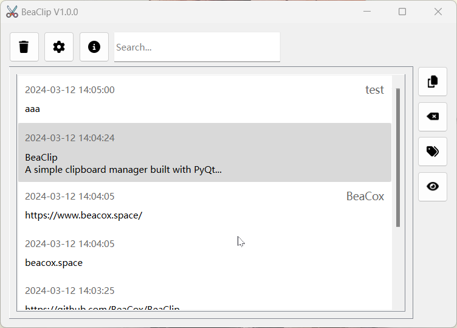

# BeaClip
A simple clipboard manager built with PyQt6.



## Features

+ BeaClip uses `PyQt6.QtWidgets.QApplication.clipboard()` to monitor the system clipboard.
+ Saved entries can be copied, tagged, searched, deleted later.
+ Support for mainstream operating systems.

## Install

## Using the App

To start BeaClip, double-click the program icon.

When copying texts, the content will be added as an entry to BeaClip automatically. 

### Sidebar

You can click the entry once to select it. Then you can manipulate the entry with sidebar buttons:

+ Copy
+ Delete
+ Add/modify a tag
+ Show the full content of an entry

You can also double-click on an entry to see its full content.

### Tool Bar

At the top of BeaClip is a tool bar. These buttons are used in order from left to right to:

+ Clear all entries
+ Modify configuration
+ View the information of BeaClip

### Tray icon

When closing the window, BeaClip is minimized to the tray instead of exiting. You can later right-click the tray icon to quit the program.

When right-clicking on the tray icon, the top entry displays the currently copied content. Under the split line are 3 buttons:

+ Show: show the main window
+ Hide: hide the main window
+ Quit: quit the program completely

### Configurations

There are two configuration items that can be modified: 

+ Whether or not to allow BeaClip to start on system boot
+ Maximum number of days for which an entry should be retained

**All changes require a reboot to take effect!**

## Start from Source Code

1. Install the dependencies

   ```shell
   git clone https://github.com/wytili/EtherScope.git
   pip install -r requirements.txt
   ```

2. Run python

   ```shell
   cd src
   python main.py
   ```
   
3. If you want to build executable files, you need to install [pyinstaller](https://www.pyinstaller.org/) first

   ```shell
   pip install pyinstaller
   ```

   Switch to the root directory of the project and run:

   ```shell
   pyinstaller --onefile --add-data "src/icons/*;icons" --noconsole --name BeaClip -i src/icons/logo.ico src/main.py
   ```

## TODO
- [x] run in the background
- [x] display copied content in the menu of the tray icon
- [x] allow starting on system boot
- [x] clear expired entries
- [ ] drag-and-drop paste
- [ ] share clipboards on LAN
- [ ] ……

## Special Thanks

[JIANGLY@iconfont](https://www.iconfont.cn/user/detail?uid=32705&nid=TTa2GNji26sj) for logo

[Font Awesome](https://fontawesome.com/) for other icons